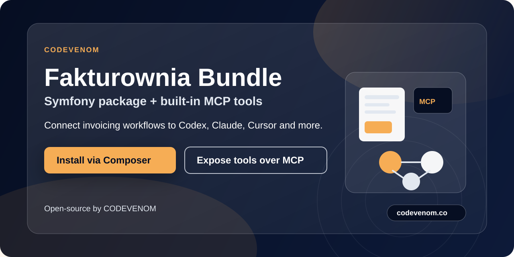

# codevenom/fakturownia-bundle
<p align="center">
  <a href="https://github.com/codevenom-co/fakturownia-bundle">
    
  </a>
</p>

Symfony bundle for the Fakturownia API with built-in MCP tools.

## What This Gives You

- Fakturownia integration as a standard Symfony service (`InvoiceClient`, `CustomerClient`, `PricingClient`).
- Multi-context architecture (Invoice, Customer, Pricing, Report) for clean domain boundaries.
- Ready-to-use MCP tools that can be exposed to any AI agent through `symfony/mcp-bundle`.
- Built-in financial reporting engine with extensible strategies.
- A single Composer package, without a separate MCP microservice.

## Available MCP Tools (v1)

| Domain | Tool Name | Description |
| :--- | :--- | :--- |
| **Invoices** | `codevenom.fakturownia.invoice.add` | Create a new invoice in Fakturownia. |
| | `codevenom.fakturownia.invoice.find_by_number` | Finds an invoice by its number. |
| **Customers** | `codevenom.fakturownia.customer.list` | Lists all customers from Fakturownia. |
| | `codevenom.fakturownia.customer.find_by_id` | Finds a customer by their ID. |
| | `codevenom.fakturownia.customer.add` | Add a new customer to Fakturownia. |
| | `codevenom.fakturownia.customer.update` | Update an existing customer in Fakturownia. |
| | `codevenom.fakturownia.customer.delete` | Delete a customer from Fakturownia. |
| **Pricing** | `codevenom.fakturownia.pricing.list` | Lists all price lists from Fakturownia. |
| | `codevenom.fakturownia.pricing.add` | Adds a new price list to Fakturownia. |
| | `codevenom.fakturownia.pricing.update` | Updates an existing price list in Fakturownia. |
| | `codevenom.fakturownia.pricing.delete` | Deletes a price list from Fakturownia. |
| **Reports** | `codevenom.fakturownia.report.get` | Generates decision-ready financial reports (health, AR aging, cash forecast, DSO trend, etc.). |

## Requirements

- PHP 8.1+
- Symfony 6.4+, 7.x or 8.x
- `symfony/mcp-bundle` (optional, for MCP tools support)

## Installation

```bash
composer require codevenom/fakturownia-bundle
```

If you want to use MCP tools (requires Symfony 7.3+):

```bash
composer require symfony/mcp-bundle
```

## Symfony Configuration

`config/packages/codevenom_fakturownia.yaml`

```yaml
codevenom_fakturownia:
  base_url: '%env(FAKTUROWNIA_BASE_URL)%' # e.g. https://your-subdomain.fakturownia.pl
  api_token: '%env(FAKTUROWNIA_API_TOKEN)%'
  seller_name: 'Your Company Name'
  seller_tax_id: 'PL1234567890'
  timeout: 15
```

`.env`

```dotenv
FAKTUROWNIA_BASE_URL=https://your-subdomain.fakturownia.pl
FAKTUROWNIA_API_TOKEN=your_api_token
```

`config/routes.yaml`

```yaml
mcp:
  resource: .
  type: mcp
```

`config/packages/mcp.yaml`

```yaml
mcp:
  app: 'CHANGE_ME'
  version: '1.0.0'
  description: '....'
  client_transports:
    stdio: true
    http: true
```

## Run MCP Server (stdio)

```bash
php bin/console mcp:server
```

This is the command you register as an MCP server in the client (e.g. Codex/VS Code).

## Example MCP Client Configuration (STDIO)

```json
{
  "mcpServers": {
    "codevenom-fakturownia": {
      "command": "php",
      "args": ["/abs/path/to/project/bin/console", "mcp:server"],
      "env": {
        "APP_ENV": "prod",
        "FAKTUROWNIA_BASE_URL": "https://your-subdomain.fakturownia.pl",
        "FAKTUROWNIA_API_TOKEN": "***"
      }
    }
  }
}
```

## Note About MCP Capability Auto-Discovery

`symfony/mcp-bundle` discovers capabilities via attributes (`#[McpTool]`).
In most setups, it is enough that the attributed service is loaded by the container.

If vendor capabilities are not automatically discovered in your app, ensure that the bundle services are correctly imported in your `services.yaml`:

```yaml
imports:
    - { resource: '@CodevenomFakturowniaBundle/Resources/config/services.yaml' }
```

## Product Strategy

This package is both a library and MCP integration:
- as a library: you can use `FakturowniaClient` without AI,
- as MCP: you expose the same use cases to AI agents through the MCP standard.

This lets you deploy the bundle in SHARDN while also publishing it as a public CODEVENOM OSS package.


## Development

If you have Docker and [Task](https://taskfile.dev/) installed, you can easily run tests and tools:

```bash
task install
task test
task cs-fix
task verify-recipes
```

## Recipe Verification

To verify that the bundle and its recipes work correctly across different PHP and Symfony versions (similar to the QA pipelines in `symfony/recipes-contrib`), you can use the provided verification script:

```bash
./scripts/verify-recipes.sh 8.1 6
./scripts/verify-recipes.sh 8.4 6
./scripts/verify-recipes.sh 8.4 7
./scripts/verify-recipes.sh 8.4 8
```

Note: All verification scenarios should now pass. Symfony 6 scenarios do not include `symfony/mcp-bundle` as it is not compatible with Symfony 6.

Or via Task:

```bash
task verify-recipes
```

This requires Docker to be installed on your machine.